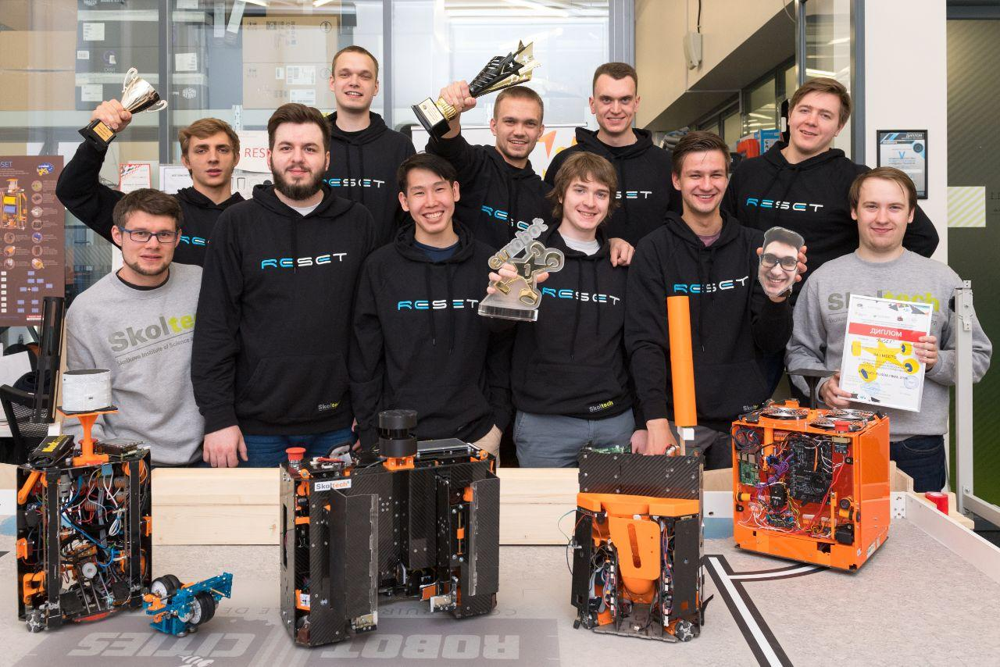

# ros-eurobot-2018

`How to run this:`  

`$ cd /path/to/catkin_ws/src`  
`$ git clone https://github.com/SkoltechRobotics/ros-eurobot-2018.git`  
`$ cd /path/to/catkin_ws`  
`$ catkin_make`  
`$ source devel/setup.bash`  
`$ rospack find eurobot_decision_maker`

`Might require:`  
`$ sudo apt-get install ros-kinetic-moveit ros-kinetic-rviz-visual-tools ros-kinetic-move-base ros-kinetic-map-server`

`How to use LIDAR:`  
`We use urg_node, a ROS package that works with Hokuyo lidars`  

`How to work with lidar:`  
`1. Connect lidar via Ethernet.`  
`2. Set on computer IP 192.168.0.XX, where XX != 10 (192.168.0.10 is the IP of the lidar):`  
`$ sudo ifconfig "interface_name" 192.168.0.XX netmask 255.255.255.0`  
`3. Run urg_node with the command:`  
`$ rosrun urg_node urg_node _ip_address:=192.168.0.10`  
`4. Done. Now there is a topic "/scan"`  
`If it does not work, make sure you can ping lidar.`  

`sensor_msgs/LaserScan Message contains timing of the scan. If the lidar is moving during scanning, it is possible to make corrections of the scanned "slice" (using odometry data). However the error related to lidar movement is probably really small. If so, we can just not care about it.`  

`How to work on PC with lidar, connected to RPI:`  
`1. For each computer other than master computer (XXX - master computer IP):`  
`$ export ROS_MASTER_URI=http://192.168.2.XXX:11311`  
`2. For each computer (XXX - this computer IP):`  
`$ export ROS_IP=192.168.2.XXX`  
`3. Now everything should work properly. For further instructions comment to "ROS nodes for electronics".`  

`To start move to heap using rangefinder node:` 
`1. Put robot on heap`  
`2. See topic /distances`  

`Install Computer Vision libraries`  
`1. Install pip2`  
`2. Run sudo pip2 install scikit-image`

`Disable sync time`  
`1. Run date to watch current datetime`  
`2. Run timedatectl to see settings`  
`3. Run sudo update-rc.d -f ntp remove`  
`4. Run systemctl disable --now systemd-timesyncd.service`  
`5. Reboot`  
`6. To start ntp Run sudo service ntp start`
